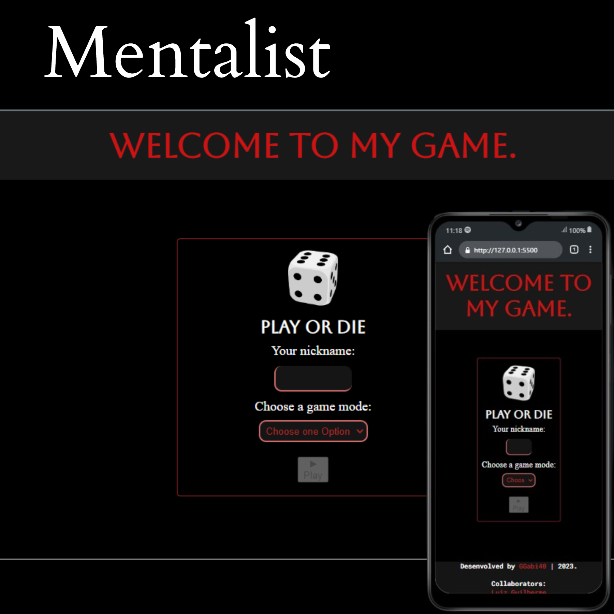

<h1>Mentalist</h1>

This project was maded for Alura's Challenge, 5 days coding JavaScript.

 
<h2>Mentalist</h2>

 

<h2>📚Tecnologies:</h2>

<ul>
    <li>HTML</li>
    <li>CSS</li>
    <li>JavaScript</li>
    <li>Git and Github</li>
</ul>

<h2>💻Project:</h2>

This project is a game, thought by Alura, in which the user must guess the number created by a function that generates random numbers from 0 to 100. When he loses the game, he counts the amount of attempts that this player had. When you win, a message will appear saying you won the game.

Visit the Project Online: <a href="https://ggabi40.github.io/Mentalist">https://ggabi40.github.io/Mentalist</a>

 

Desenvolved by GGabi40 | Inspired by Alura.
